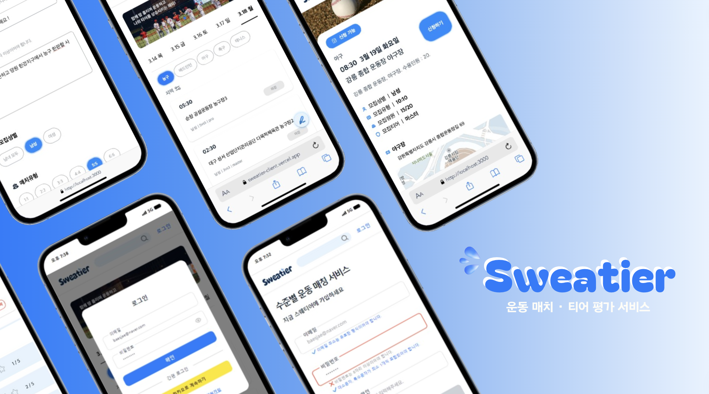
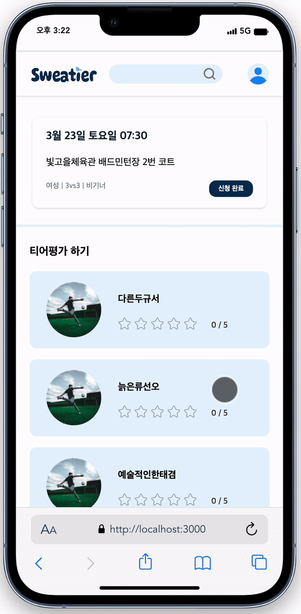
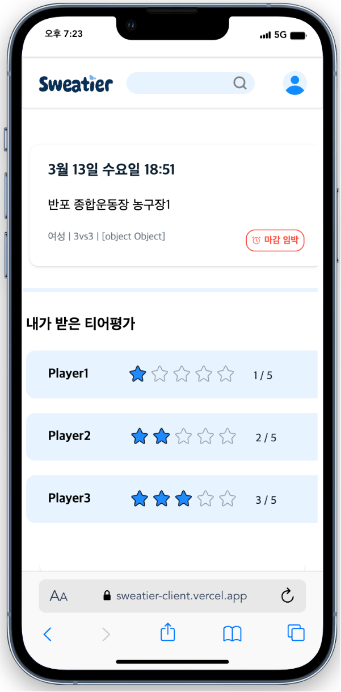
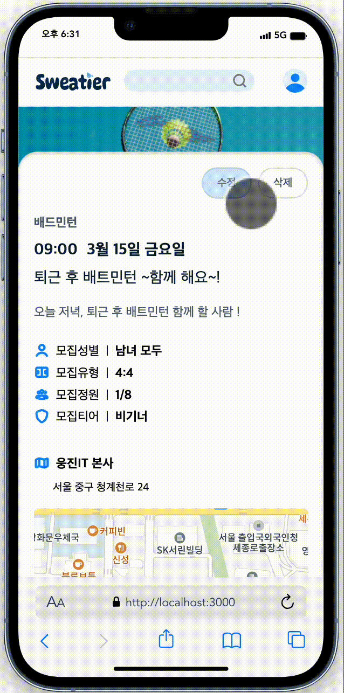
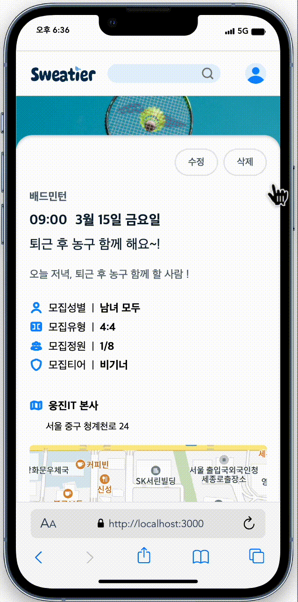

# [Sweatier](https://sweatier-client.vercel.app/)

## 💧 목차

[1. 프로젝트 및 서비스 소개](https://github.com/team-sweatier/sweatier-client?tab=readme-ov-file#1-%ED%94%84%EB%A1%9C%EC%A0%9D%ED%8A%B8-%EB%B0%8F-%EC%84%9C%EB%B9%84%EC%8A%A4-%EC%86%8C%EA%B0%9C)  
[2. 팀원 소개](https://github.com/team-sweatier/sweatier-client?tab=readme-ov-file#2-%ED%8C%80%EC%9B%90-%EC%86%8C%EA%B0%9C)  
[3. 기술 스택](https://github.com/team-sweatier/sweatier-client?tab=readme-ov-file#3-%EA%B8%B0%EC%88%A0-%EC%8A%A4%ED%83%9D)  
[4. 주요 기능](https://github.com/team-sweatier/sweatier-client?tab=readme-ov-file#4-%EC%A3%BC%EC%9A%94-%EA%B8%B0%EB%8A%A5)  
[5. 시현 화면](https://github.com/team-sweatier/sweatier-client?tab=readme-ov-file#5-%EC%8B%9C%ED%98%84-%ED%99%94%EB%A9%B4)  
[6. 팀원별 트러블 슈팅](https://github.com/team-sweatier/sweatier-client?tab=readme-ov-file#6-%ED%8C%80%EC%9B%90%EB%B3%84-%ED%8A%B8%EB%9F%AC%EB%B8%94-%EC%8A%88%ED%8C%85)  
[7. Github 전략](https://github.com/team-sweatier/sweatier-client?tab=readme-ov-file#7-github-%EC%A0%84%EB%9E%B5)  
[8. 주요 문서 링크](https://github.com/team-sweatier/sweatier-client?tab=readme-ov-file#8-%EC%A3%BC%EC%9A%94-%EB%AC%B8%EC%84%9C-%EB%A7%81%ED%81%ACs)

 

## 1. 프로젝트 및 서비스 소개

**Sweatier**는 수준별 운동 매칭을 통해 실력이 비슷한 사람들과 운동을 즐기고 사용자의 운동 수준(티어)을 평가받을 수 있는 서비스입니다.  
땀을 의미하는 **Sweat 💧**와 등급을 의미하는 **Tier 🎖️**를 결합해, 유저들과 함께 땀을 흘리며 당신의 운동 티어를 올려보세요!

• **개발기간** : 2024.02.29 - 2024.03.15  
• **팀 구성** : FE 3명, BE 3명, 디자이너 1명  
• [배포 주소](https://sweatier-client.vercel.app/)  
• [발표 PPT](https://www.canva.com/design/DAF_eGLYB6Y/ov4cFLs5zKZktzLgKcqvKg/edit?utm_content=DAF_eGLYB6Y&utm_campaign=designshare&utm_medium=link2&utm_source=sharebutton)

 

## 2. 팀원 소개

|                              심효은                              |                            배성재                             |                            장은혜                             |
| :--------------------------------------------------------------: | :-----------------------------------------------------------: | :-----------------------------------------------------------: |
|  |  |  |
|          [@haizellatte](https://github.com/haizellatte)          |        [@baeseongjae](https://github.com/baeseongjae)         |         [@Jangeunhye](https://github.com/Jangeunhye)          |
|         매치 게시물 CRUD 페이지   Kakao Map API 연동          |               회원 인증 페이지   마이 페이지               |           메인페이지   티어 평가 및 조회 페이지            |

 

## 3. 기술 스택

 

## 4. 주요 기능

#### 사용자

- 회원가입 및 로그인
- 유저 정보 등록 및 프로필 변경
- 신청내역 및 경기내역 조회
- 티어 정보 조회
- 관심 종목 설정

#### 경기

- 경기 리스트 조회
- 경기 상세 정보 조회 및 참여 가능 여부 확인
- 경기 참여 신청
- 경기 모집글 수정 및 관리
- 경기 결과 등록 및 평가

 

## 5. 시현 화면

### 👀 회원 인증

### 👀 메인페이지 / 경기 검색 페이지 (장은혜)

|                 메인 페이지                 |                   경기 검색 페이지                   |
| :-----------------------------------------: | :--------------------------------------------------: |
|  |  |

#### 메인페이지

- 종목, 날짜, 지역 별로 해당하는 경기 정보 조회 가능
  - 디폴트 값은 오늘 날짜, 농구, 전체 지역
  - 날짜는 오늘 날짜 기준으로 14일 내 경기만 조회 가능
- `마감`, `마감 임박`, `신청 가능` (인원 80%이상 모집 시) 상태로 사용자에게 인원 현황 제공
- 로그인한 유저일 시, `신청 완료`, `신청불가` ( 다른 티어 경기 참여 불가 ) 상태 추가 제공
- 스크롤 시 하단 플로팅 버튼 고정, 클릭하면 게시글 작성 페이지 이동

#### 경기 검색 페이지

- 헤더 검색창에 경기명, 경기내용에 해당하는 정보 검색
- 메인페이지 경기 컴포넌트 재활용

 

### 👀 티어 평가 페이지 / 티어 조회 페이지 (장은혜)

|              티어 평가 페이지 (Create)               |                평가 조회 페이지(Read)                |
| :--------------------------------------------------: | :--------------------------------------------------: |
|  |  |

#### 티어 평가 페이지

- 본인 제외 경기 참여자들의 실력 평가 기능
- 1명 이상 평가 시 , 평가 제출 버튼 활성화

#### 티어 조회 페이지

- 해당 경기의 유저의 실력에 대해 받은 평가 조회
- 평가자의 정보는 익명으로 평점 제공

 

### 👀 게시물 페이지 (심효은)

|             게시물 생성 (Create)             |                   게시물 조회 (Read)                   |
| :------------------------------------------: | :----------------------------------------------------: |
|  |  |

|             게시물 수정 (Update)             |                 게시물 삭제 (Delete)                 |
| :------------------------------------------: | :--------------------------------------------------: |
|  |  |

#### 게시물 생성 (Create)

- 종목, 제목, 내용, 모집 성별, 매칭 유형, 날짜, 경기 시작 시간, 경기장 위치 를 모두 입력해야 게시물 생성 가능
- 한 페이지 내 Input 및 Select box 등 여러 입력 필드로 인해 불필요한 렌더링이 발생하는 것을 방지하기 위해 **제출 시에만** 값을 동기화 하도록 **비제어 컴포넌트 구현**
- `react-kakao-map-sdk` 라이브러리를 사용해 경기장 위치를 kakao map 기반으로 검색 가능

#### 게시물 조회 (Read)

- 타유저 / 유저의 게시물 유효성 검사
  - 타 유저의 게시물일 경우, 신청 여부에 따라 `신청하기` 또는 `신청 완료` 여부 확인 가능
    - 마감 여부에 따라 `마감` 여부 확인 가능
    - 총 모집 정원의 80% 이상 모집되었을 시, `마감 임박`으로 표시
  - 유저의 게시물일 결우, `수정` 및 `삭제` 가능
- 경기 참여 신청을 한 경기의 게시물인 경우에만 호스트 유저의 계좌번호 확인 가능

#### 게시물 수정 (Update)

- 유저가 작성한 게시물에만 수정 버튼이 보이도록 조건부 렌더링
- 게시물 작성 컴포넌트 재사용
- 수정 전 데이터값이 `default value`로 설정

#### 게시물 삭제 (Delete)

- 유저의 게시물일때만 삭제 버튼이 보이도록 조건부 렌더링
- `삭제`후, 메인페이지로 redirect

 

## 6. 팀원별 트러블 슈팅 (추가 예정)

 

## 7. Github 전략

### Branch 관리 규칙

- **develop** : 개발 서버에 배포하는 데 사용되는 주요 개발 브랜치
- **feat** : GitHub 이슈에 대응하여 개발 서버에 배포하기 위한 기능을 개발하는 브랜치
- **hotfix** :개발 서버에 배포된 버전에 문제가 발생했을 때 해결하기 위해 사용되는 브랜치

### Commit Convention

- commitlint & Husky 활용

|   유형   |                 설명                 |
| :------: | :----------------------------------: |
|   feat   |       새로운 기능에 대한 커밋        |
|   fix    |        버그 수정에 대한 커밋         |
|  chore   |    그 외 자잘한 수정에 대한 커밋     |
|   docs   |        문서 수정에 대한 커밋         |
|  style   | 코드 스타일 혹은 포맷 등에 관한 커밋 |
| refactor |      코드 리팩토링에 대한 커밋       |
|   test   |     테스트 코드 수정에 대한 커밋     |

 

## 8. 주요 문서 링크

[🔗 유저플로우](<https://www.figma.com/file/7YYZRa9AEO4YM1jG93BwLv/UserFlow-(Community)?type=whiteboard&t=suFE8Cmnz7qvelJ2-0>)  
[🔗 화면정의서](https://www.figma.com/file/Upx7Oq28OJtC8o7W73QeCz/%ED%99%94%EB%A9%B4%EC%A0%95%EC%9D%98%EC%84%9C?type=design&node-id=0-1&mode=design&t=ruSkyqk9zO33uDmp-0)  
[🔗 디자인시스템](https://www.figma.com/file/XWbNPE3mun1oFNwXxLNvtX/%EB%94%94%EC%9E%90%EC%9D%B8%EC%8B%9C%EC%8A%A4%ED%85%9C-%EC%9E%91%EC%97%85%EC%A4%91?type=design&node-id=0%3A1&mode=design&t=d1VYzJYXhvUsrX3p-1)
